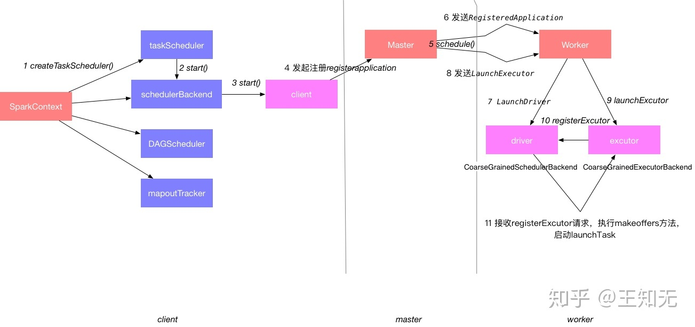
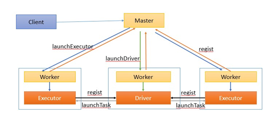
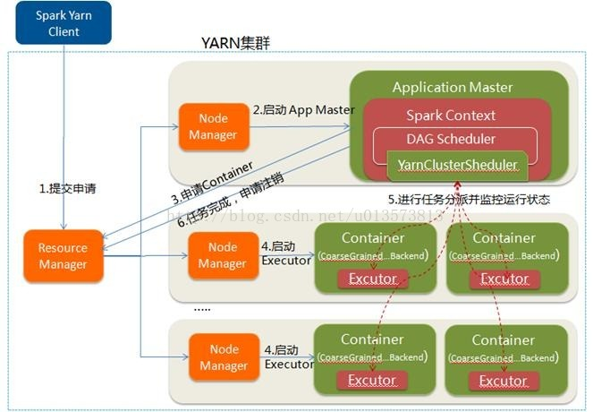
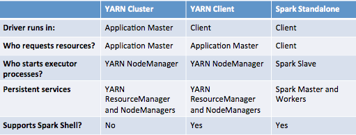

## Spark Standalone, YARN-Cient, YARN-Cluster

Runtime

Standalone

Client ：客户端进程，负责提交作业到Master

Master ：Standalone模式中主控节点，负责接收Client提交的作业，管理Worker，并命令Worker启动Driver和Executor

Driver ： 一个Spark作业运行时包括一个Driver进程，也是作业的主进程，负责作业的解析、生成Stage并调度Task到Executor上。包括 DAGScheduler ， TaskScheduler 

Worker ：Standalone模式中slave节点上的守护进程，负责管理本节点的资源，定期向Master汇报心跳，接收Master的命令，启动Driver和Executor

YARN-Client

YARN-Cluster

Compare

